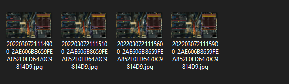
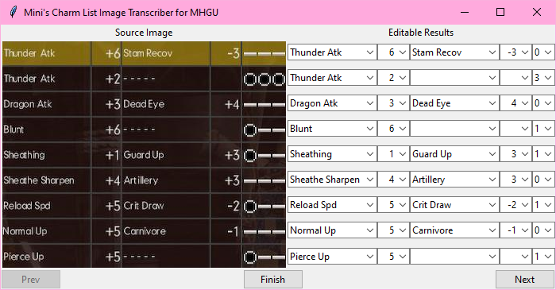

# Charm-List-Image-Transcriber-MHGU
This program looks at screenshots of your charms and attempts to compile them into a "mycharms.txt" file that Athena's Armor Set Search can read and import. It is currently designed to work only with MHGU screenshots taken with the Switch's built-in screenshot button. So far this program is incredibly barebones and is designed to streamline the process as much as possible at the expense of some pretty standard features.

## Guide
The program is pretty straightforward but there are some things that you need to be careful about when running it to make sure you don't get stuck or cause an error.

First thing's first, boot up MHGU and go to any of your equipment chests. Pull up your list of charms and take a screenshot of every page.

### Screenshot of game

Transfer those screenshots to your computer by whatever means are most ready available to you. From here, go ahead and launch the program.

Once it loads, the program should make the "Input", "Output", and "Pages" folders in the same directory as itself if they don't already exist.

Go ahead and prep a folder (it doesn't have to be the provided Input folder, but using the Input folder streamlines things) with all of your screenshots. Make sure the folder *only* contains screenshots of your charm list and nothing else, just like this:

Back in the program, click "Browse" to direct the program to the folder with your screenshots. You won't see your screenshots in the file selector but if you select the correct folder the program will work just fine. Go ahead and click start and wait for the program to process all of your screenshots. Once that's done, it'll pull up the editable results page.

Make sure the results on the right match the cropped screenshot on the left. If you have more than one page you can click the "Prev" and "Next" buttons to change which page you're looking at.

Once you're finished checking and editing the results, click the Finish button to select an output directory for your mycharms.txt file.

## Importing to Athena's Armor Set Search
