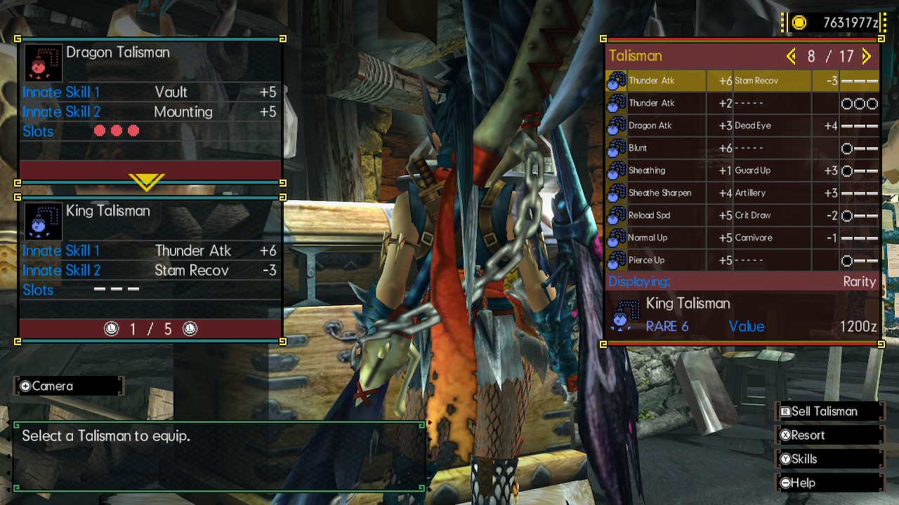
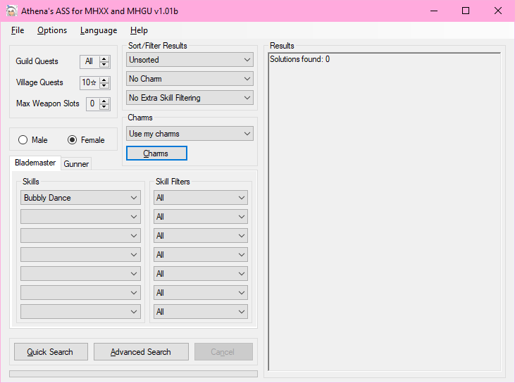
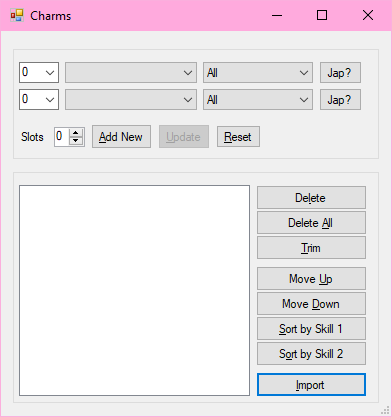
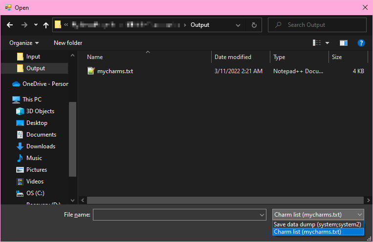
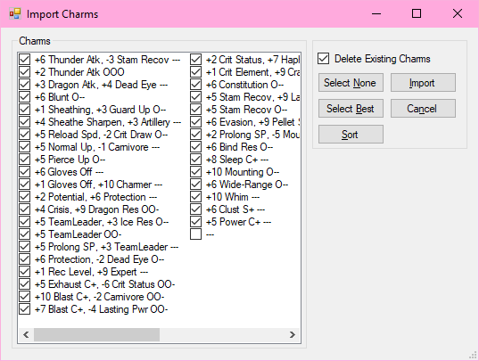

# Mini's Charm List Image Transcriber for MHGU
This program looks at screenshots of your charms and attempts to compile them into a "mycharms.txt" file that Athena's Armor Set Search can read and import. It is currently designed to work only with MHGU screenshots taken with the Switch's built-in screenshot button. So far this program is incredibly barebones and is designed to streamline the process as much as possible at the expense of some pretty standard features.

## Guide
The program is pretty straightforward but there are some things that you need to be careful about when running it to make sure you don't get stuck or cause an error.

First thing's first, boot up MHGU and go to any of your equipment chests. Pull up your list of charms and take a screenshot of every page.

Transfer those screenshots to your computer by whatever means are most ready available to you. From here, go ahead and launch the program.

Once it loads, the program should make the "Input" and "Output" folders in the same directory as itself if they don't already exist.

Go ahead and prep a folder (it doesn't have to be the provided Input folder, but using the Input folder streamlines things) with all of your screenshots. Make sure the folder *only* contains screenshots of your charm list and nothing else, just like this:

Back in the program, click "Browse" to direct the program to the folder with your screenshots. You won't see your screenshots in the file selector but if you select the correct folder the program will work just fine. Go ahead and click start and wait for the program to process all of your screenshots. Once that's done, it'll pull up the editable results page.

Make sure the results on the right match the cropped screenshot on the left. If you have more than one page you can click the "Prev" and "Next" buttons to change which page you're looking at.

Once you're finished checking and editing the results, click the Finish button to select an output directory for your mycharms.txt file.

## Importing to Athena's Armor Set Search

Start by opening Athena's Armor Set Search

Select Charms

Select Import, then navigate to where you set the output to earlier. Make sure you change the file type to "Charm list (mycharms.txt)" as shown in the bottom right of the following image.

Enjoy not having to input everything manually anymore!

As an aside: If any of your charms here are unchecked when you load it in, it means you have another charm that is *better* than that charm, and you can sell or meld it in-game. Clicking Import on this page will import all checked charms into Athena's Armor Set Search to use with set building.

## Q&A
### Will you make this for MH Rise or (insert any other Monster Hunter Game here)?
At the moment, no. I only have access to MH4U and MHG on 3DS and MHGU on Switch, and only the Switch has a good screenshot feature. I *do* plan on getting MH Rise for Switch, so Rise may get it's own version in the future.

### For some reason the program isn't reading certain skills/numbers from my screenshots and I have to fix them every single time and its annoying!!
Please file an issue and attatch the screenshot that has the charm that's giving you issues, I'll take a look at it!

### Can you make this for any other language?
I cannot, sorry. If anyone else wants to try their hand at sifting through my code and programming new languages in, please be my guest!

### Can you please change the name of the program?
No💖

### Can I send you some money as thanks?
Yes!! You can buy me a coffee!! ~~or more likely a hot chocolate~~

