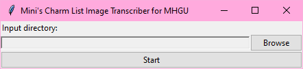

# Charm-List-Image-Transcriber-MHGU
This program looks at screenshots of your charms and attempts to compile them into a "mycharms.txt" file that Athena's Armor Set Search can read and import. It is currently designed to work only with MHGU screenshots taken with the Switch's built-in screenshot button. So far this program is incredibly barebones and is designed to streamline the process as much as possible at the expense of some pretty standard features.

## Guide
The program is pretty straightforward but there are some things that you need to be careful about when running it to make sure you don't get stuck or cause an error.

First thing's first, boot up MHGU and go to any of your equipment chests.

When you launch the program, you should see this directory input first.

Additionally, the program should make the "Input", "Output", and "Pages" folders in the same directory as itself if they don't already exist.

Go ahead and prep a folder (it doesn't have to be the provided Input folder) with all of your screenshots.

Back in the program, click "Browse" to direct the program to the folder with your screenshots. You don't need to use the provided Input folder but it'll make things faster if you do.
